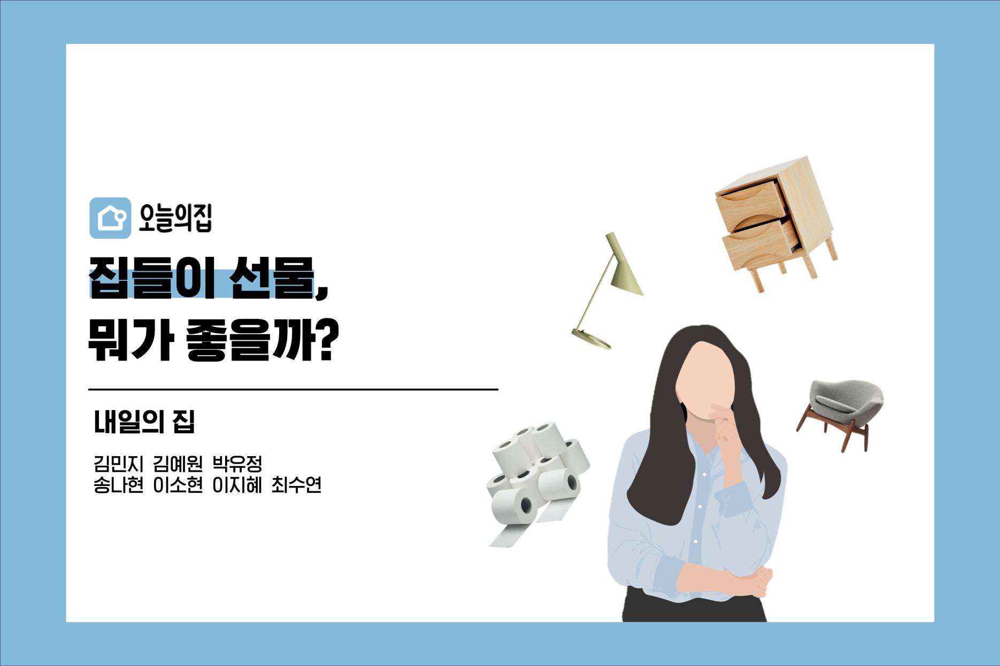
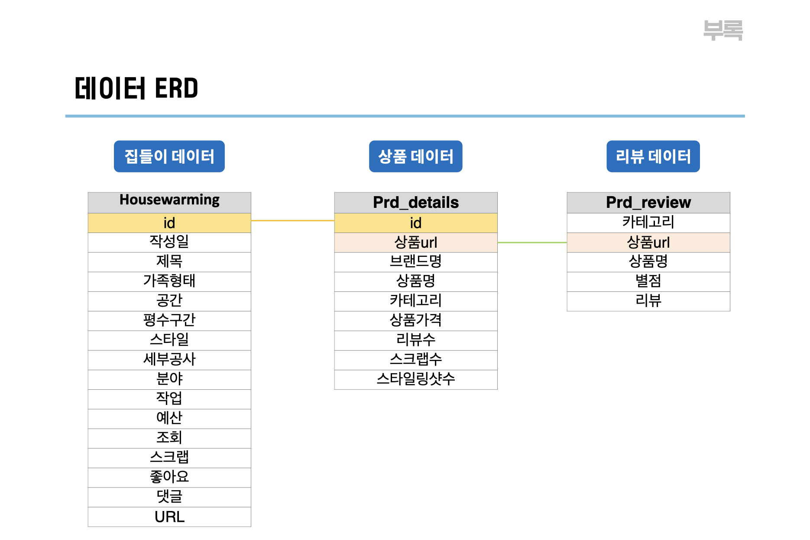
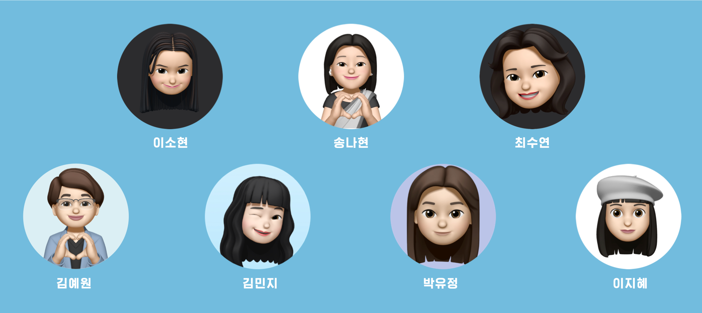

# 🏠 내일의 집 : 오늘의집 데이터 분석 프로젝트

- 프로젝트 기간 : 2022.10 ~ 2022.11
- 발표자료 : [발표 자료 바로가기](nae_house_pt.pdf)
- 2022 데잇걸즈 데모데이 한국정보화진흥원 원장상 수상 🏆

---
### 주제 선정
오픈 서베이 조사 결과 인테리어 소품을 구매할 때 가장 중요하게 생각하는 요소는 ‘집안 분위기와의 어울림’이었습니다. 
이 결과를 바탕으로 상품을 분위기를 기반으로 추천해준다면 어떨까? 라는 질문에서 출발한 데이터 분석 프로젝트입니다.

상기 질문에 대한 답을 찾기 위해 오늘의집 데이터를 활용하여 데이터 분석을 진행하였습니다. 
오늘의집은 다른 플랫폼과는 달리 작성자가 직접 분위기를 태깅한 집들이 컨텐츠를 가지고 있습니다. 
집들이 컨텐츠에서 분위기를 분류할 수 있는 텍스트를 추출하고, 각 상품의 분위기를 정의한 후 분위기에 기반한 상품을 추천해드립니다.

---
### 데이터 수집

- **집들이 데이터 (이용자 정보)** : 오늘의 집 '집들이' 이용자가 직접ㅈ 올린 게시물에서 본인 집의 인테리어, 가족 형태, 주거 형태 그리고 구매 상품 등 정보를 수집하였습니다.
  - 수집 시점 : 22년 10월  
  - 수집 범위 : 2020년 1월 1일 ~ 2022년 10월 (작성일자 기준)
  - 수집량 : 약 4천 6백 건 (게시글 기준)
  - 컬럼명 : id, 제목, 가족형태, 공간, 평수구간, 스타일, 셋부공사, 분야, 작업, 예산, 조회, 스크랩, 좋아요, 댓글, url
  
- **상품 데이터** : 이용자가 집들이 게시물에 소개한 상품들과 카테고리별 대표 상품을 스크래핑하였습니다.
  - 수집량 : 약 22만 건  
  - 컬럼명 : id, 상품url, 브랜드명, 상품명, 상품가격, 카테고리, 리뷰수, 스크랩수, 스타일링샷수, 작성일

- **리뷰 데이터** : 위 상품 데이터의 리뷰 스크래핑하여 수집하였습니다.

---
### 결과
- **분위기 기반 추천**
    - 구매할 상품을 특정하지 못한 경우 상품 카테고리에 관계 없이 분위기로 필터링된 상품 추천합니다.
    - 기존 상품에 분위기를 라벨링하여 분위기 정보를 추가로 제공합니다.
- **상품 조합 추천**
    - A와 B의 조합을 추천한다면, A상품 페이지의 추천 탭에 같은 분위기 상품을 추가하여 B상품 추천합니다.
    - 예산 필터링을 추가해 예산 안에서 분위기가 잘 맞는 두 상품 추천합니다.
    - 본인이 가지고 있는 상품과 어울리는 조합 상품 추천합니다.

---
### 결과 발표
[데모데이 발표 영상](https://drive.google.com/file/d/174-3qwHxanEfM5FY-H3GO69z1xc-Fe79/view)

---
### 참여 멤버

| 이름     | E-mail              |
|----------|--------------------|
| 김민지    | dallaemin.kim@gmail.com   |
| 김예원    | kimyewon09826@gmail.com  |
| 박유정    | skyggg3@gmail.com|
| 송나현    | skgusgo@gmail.com|
| 이소현    | skshyun123@gmail.com|
| 이지혜    | snidel@gmail.com|
| 최수연    | tndus8945@gmail.com|

